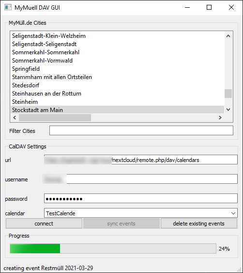

# MyMuell 2 CalDAV

Simple tool to retrive dates for garbage disposal from _MyMüll.de_ and sync it with a CalDAV Server, e.g. Nextcloud

## Motivation
_MyMüll.de_ is a web service / app provider which is used by some bavarian municipalities to digitally announce upcoming dates for garbage disposal.
Although this is basically a good idea, _MyMüll.de_ does not provide any convenience functionality to import these dates in a standard calendar to use your favourite calendar app.

Instead, users are forced to install the buggy and heavy battery draining _MyMüll.de_ smartphone app. On some android devices (e.g. Huawei), even the notifications of the app do not work reliable by default
(only after changing some settings related to app start policies)

So this tool aims to get rid of the app by parsing data from _MyMüll.de_ web service and synchronize the events with a conventional CalDAV server.

##Changelog
* 1.0.0 - initial version

## Implementation Status
- all required functionality implemented for basic usage
- functional GUI written in PyQt5
- persist all settings for later use
- works on Ubuntu 20.04 and Windows 10
- works reliable in combination with Nextcloud 20 with official Calendar plugin

## ToDo's
- more GUI settings
  - adjustable notification triggers for upcoming events
  - adjustable start time and event duration
    
- test/implement other CalDAV providers
  - iCloud
  - Google
    
- export the CalDAV events to a local file for manual import to a calendar
- unit tests for app

## Usage
- get url of your CalDAV principal.
  For Nextcloud, this `https://your.nextcloud.domain/nextcloud/remote.php/dav/calendars`
- Start app and edit url, user and password of your CalDAV server
- press _connect_ button and wait for message that connection was successful.
- select an available calendar from drop down or insert a new name to create a new calendar
  - select a city from available list entries. you can use the _Filter Cities_ field to search for matching expression
- press _sync events_ button and wait for completion.
- if you want do erase all former created events by this app, press _delete existing events_ button.

## Setup
- install and setup latest python3 on your platform.
- open a shell and check if the command `python --version` works and points the intended version
- download the latest wheel package in subdirectory _releases/_ on this repository.
- install it with via following shell command:
  (the string "x.x.x" need to be replaced with the latest version number)
  
  `python -m pip install mymuell2caldav-x.x.x-py3-none-any.whl`

  
- start the tool via command `mymuell2caldav`
  - alternatively, you could start with `python -m mymuell2caldav`

## Disclaimer
This tool was developed by an annoyed _MyMüll.de_ app user as a free contribution 
to the open source community and is licenced under the **GPLv3** Licence.

This software does not stand in any relation to the official _MyMüll.de_ app or the company that provides/developes this service.
Although this software was developed by an experienced software developer to the best of his knowledge and belief 
and was basically tested on different platforms, the author can not guarantee for the proper functionality of the software.

So the user uses this software at his own risk and he is completely responsible for any damage, security issues, data loss or any additional costs, 
that might occur when using this software.

